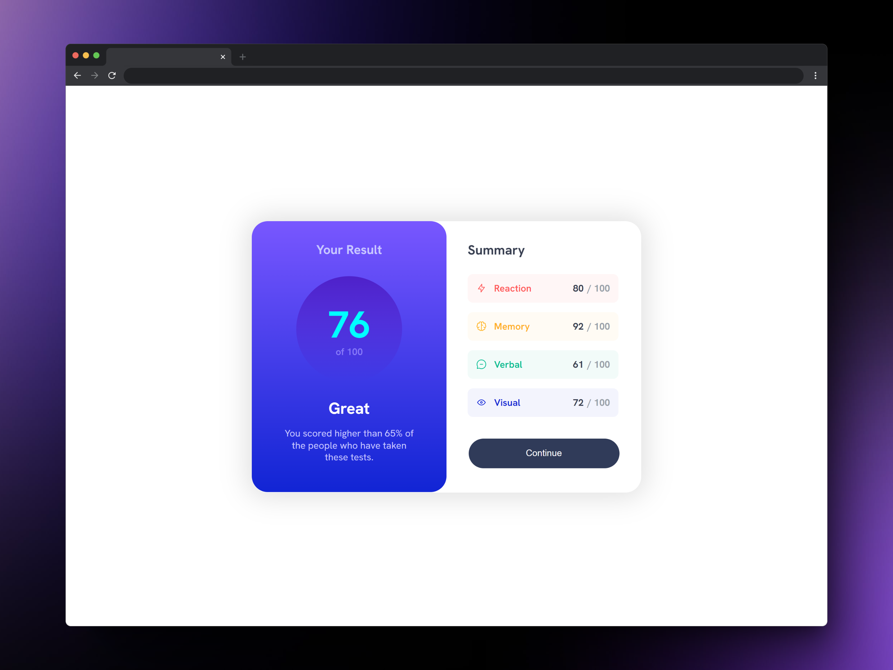
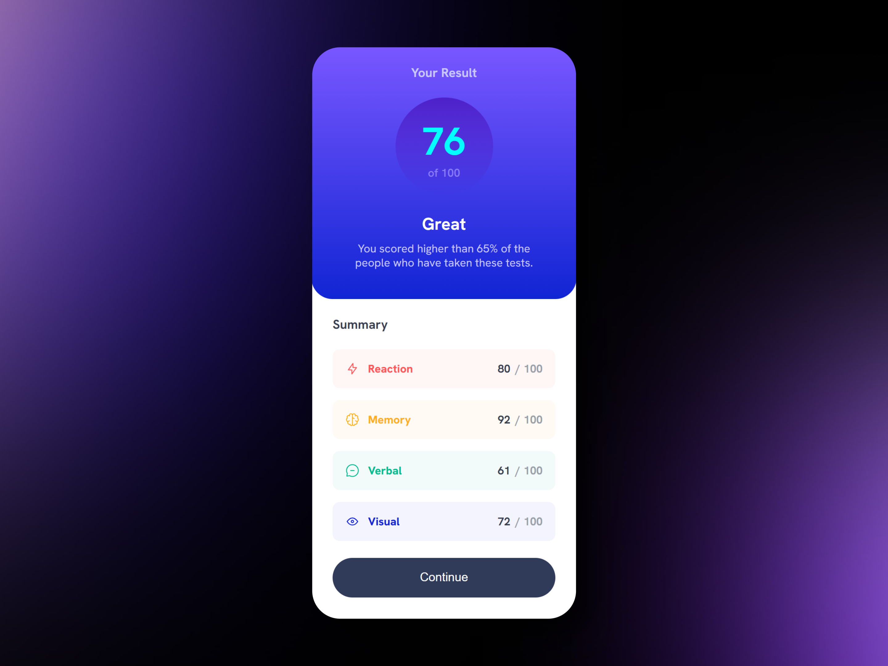

#  Results summary component

This small project was created using React and Vite.js.

## Getting Started

To get started with the project, follow these steps:

### Clone the repository

First, clone the repository to your local machine:
```
git clone https://github.com/your-username/results-summary-component-main.git
```

### Navigate to the project directory
Next, navigate to the project directory:
```
cd results-summary-component-main
```
### Install Dependencies
Install the project dependencies using pnpm:
```
pnpm install
```

### Development Server

To start the development server, run:
```
pnpm run dev
```
This command starts a local development server with hot module replacement, allowing you to see your changes in real-time as you edit your code.

### Screenshot




### Links

- Live Site URL: [Deploy at vercel here](https://results-summary-component-main-gg.vercel.app/)
- Solution URL: [Repository Github here](https://github.com/GonzaloGC/results-summary-component-main)

### Built with

- Semantic HTML5 markup
- CSS Flexbox
- [React](https://reactjs.org/) - JS library
- [Vite js](https://vitejs.dev/) - Next Generation Frontend Tooling

### Author

- Frontend Mentor - [@GonzaloGC](https://www.frontendmentor.io/profile/GonzaloGC)
- Twitter - [@gonzaloelias](https://twitter.com/gonzaloelias)

### Licencia
- Este proyecto está licenciado bajo la Licencia MIT. Consulta el archivo LICENSE para obtener más detalles.
